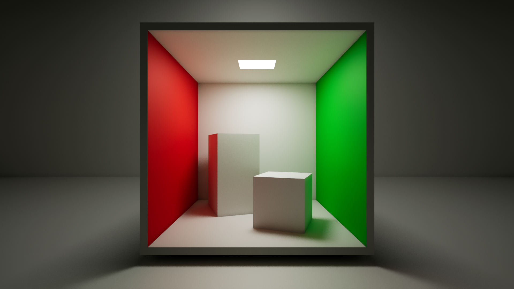
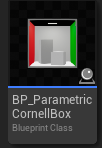
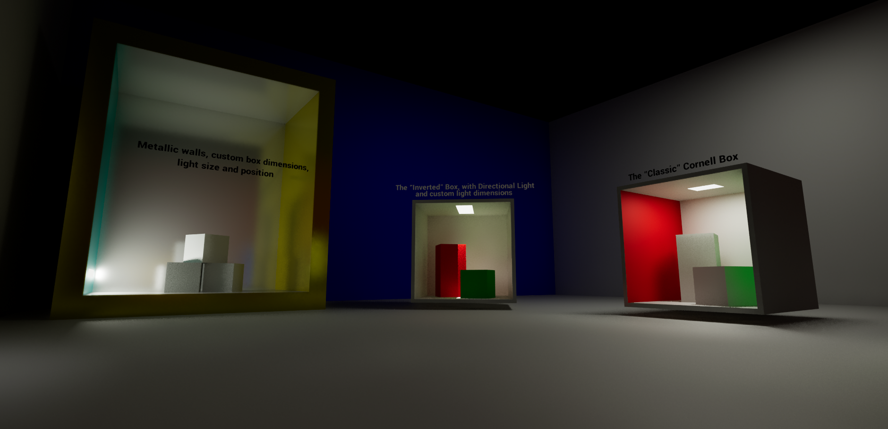
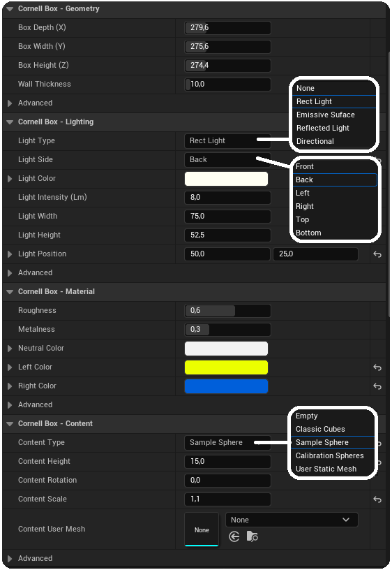
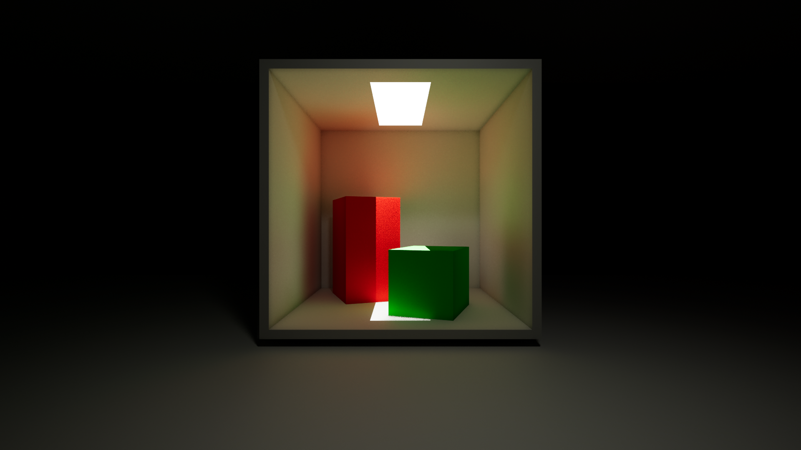
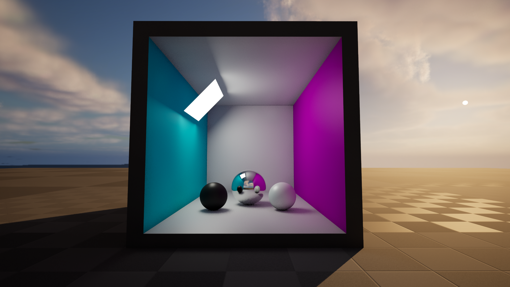
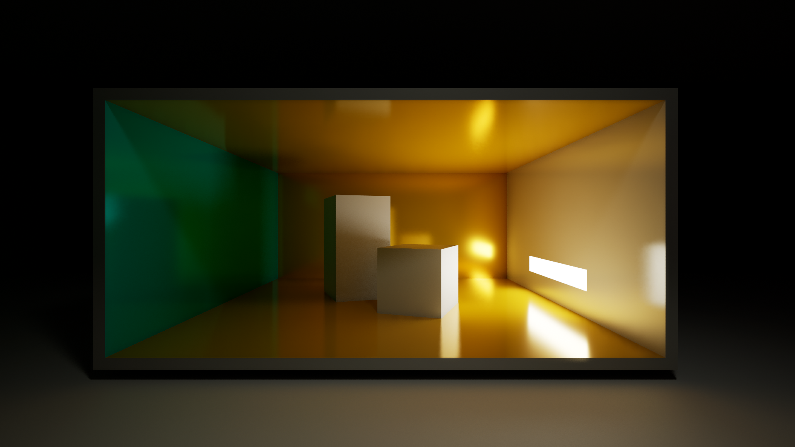

# ue5-parametric-cornell-box
A Parametric Cornell Box Actor for Unreal Engine 5

Supported Unreal Engine version: 5.2

Also available on the Unreal Engine Marketplace here: https://unrealengine.com/marketplace/en-US/product/parametric-cornell-box

## Purpose
This project provides a blueprint allowing to create fully parametric Cornell Boxes in the Unreal Editor.

A [Cornell Box](https://en.wikipedia.org/wiki/Cornell_box) is a common test case used by graphics professionals and researchers to measure the quality of a global illumination and light transport method, such as - in the case of Unreal Engine 5 - _Lumen_, _Path Tracing_, and _Static Lighting_.

The purpose of this product is to be used as a tool in the Editor to analyze and understand Lumen behavior (direct lighting, specular lighting, global illumination, reflections/mirrors) in a tightly controlled environment: a Cornell Box. The main effect to observe is the color of the walls "bleeding" on nearby objects (diffuse interreflections). Accuracy of soft-shadowing as well as quality of specular reflections can be analyzed too.

## Synopsis

- [Usage](#usage)
- [Attributes](#attributes)
- [Technical considerations](#technical-considerations)
- [Screenshots](#screenshots)

## Usage
The functionality is exposed in the Editor as a Blueprint Actor: to instantiate a new Cornell Box, simply drag and drop the __BP_CornellBox__ blueprint (in the Blueprints subfolder) in the scene. The newly instanced Box is then configurable through dedicated attributes in the _Details_ panel of the actor: dimensions, lighting setup, walls material and colors, and box contents.

Boxes are fully reconstructed each time one of their attributes is updated, allowing for interactive modification from within the Editor. This is done automatically by the blueprint construction script. 

Take a look at the [Attributes section](#attributes) for a comprehensive list of features and available attributes. 

An example map is provided in the Maps subfolder: _Showcase.umap_. This map showcases various features through different Cornell Boxes instanced in the scene.

This blueprint is intended to be mostly used with real-time Lumen and Raytracing enabled (including raytraced shadows), as well as with Path Tracing. The typical use case is to compare the results between both real-time raytracing and non-realtime path tracing. It is nevertheless possible to use it with Static Lighting, by changing the mobility attribute in the "Advanced" section of "Lighting" attributes.

For more accurate results with Lumen, be sure to enable Raytracing with Lumen (and enable Hit Lighting for Reflections), use Raytraced Shadows, and disable Lumen "Screen Traces". For better visual results with Static Lighting, use the "Production" lighting quality and disable Lightmap compression. Both CPU and GPU Lightmass works, although I find the latter gives less accurate results around the geometry edges.

## Attributes

The following screenshot gives an overview:

The individual breakdown of each attribute is the following:

### Cornell Box - Geometry

- __Box Depth (X)__
- __Box Width (Y)__
- __Box Height (Z)__
- __Wall Thickness__

These attributes are simply the box dimensions, and the global wall thickness. The defaults are set to one of a standard Cornell Box, scaled out 5 times, for practical purposes. 

By default a box is oriented following the -X direction (the opening of the box is visible when looking towards X), and its base is located at the Floor wall. 

Be sure to keep wall thickness to a reasonable value, in order to prevent potential light leaking with Lumen.

#### Advanced

- __Wall Visibilities__: allows to show/hide specific walls of the box. By default, the Front wall is not visible.
- __Geometry Mobility__: allows to change mobility of the wall geometry. By default, walls have Static mobility, so that they are both compatible with dynamic and static lighting.

### Cornell Box - Lighting

Lighting is made of two distinct elements: a Rect Light, and an Source Surface keeping the same size as the light. Their attributes and behavior depends on the Light Type selected.

- __Light Type__
  
  The following types are implemented:
  - __None__ : no lighting. This is to be used for scenarios where an external lighting source is wanted (for example, a sun light) ;
  - __Rect Light__ : the Rect Light is enabled, along with the Source Surface configured to NOT emit any real light but yet appears to be. This is for cosmetic purposes only, it is possible to disable its visibility in advanced attributes ;
  - __Emissive Surface__ : the Source Surface only, set to an Emissive material that emits real light in the scene. The emissive intensity is modulated proportionally to the emissive surface area, to keep the same intensity regarless of the surface size (like a Rect Light) ;
  - __Reflected Light__ : the Rect Light oriented towards the Source Surface set to a pure diffuse material, so that it is fully reflecting the received light toward the scene. This is roughly equivalent to an Emissive Surface ;
  - __Directional Light__ : a "local" directional light, implemented as the Rect Light set to a barn angle of zero, and a barn length set to the height of the box relative to the wall attachment side of the light.
  
- __Light Side__: to which side of the box the light is attached: _Top_, _Bottom_, _Left_, _Right_, _Front_, _Back_.
- __Light Color__: default is [1.0 1.0 0.9], that is, white with a really slight tint of yellow.
- __Light Intensity__: Value is in lumens. Note that it is computed more acurately than the default Unreal Engine behavior for the _Emissive Surface_ type.
- __Light Width__ / __Light Height__: the physical width and height of the light source. This is supported for all light types, including the _Emissive Surface_ type.
- __Light Position__: offsets in X and Y of the origin of the light on the currently attached wall.

#### Advanced 

- __Visible Rect Light Surface__: show/hide the Source Surface associated to Rect Light and Directional Light.
- __Light Z Offset__: allows the light to be "detached" from the wall, for more advanced lighting setups. By default there is a slight offset of 0.25 to prevent gemoetry confusion issues with the attachment wall.
- __Light Rotation Offset__: rotation of the full light system, around the barycenter of the box. Use with caution, as if used in conjuction with light position, you might be a bit confused on the results.
- __Light Attenuation Radius Scale__

By default the attenuation radius of the underlaying Rect Light is computed automatically according to the dimensions of the box and the 3D scale of the actor, so that the box is always at least __within__ the radius (we take the largest box dimension as reference). It is nevertheless possible to tweak the radius to greater values by applying a scale to the final computed radius through this attribute.
- __Light Mobility__: allows to change mobility of the lighting system. By default it is set to Movable, so that light does not produce any static lighting. Change it to Static (or Stationary) for Static Lighting scenarios.

Note that for Static Lighting, the geometry of the box (both walls and box content) have their UVs correctly setup as well as a lightmap resolution of 512 for the walls and 256 for the content, which should be enough for human-scale scenes. For larger scenes, the lightmap resolution might need to be tweaked (you may modify the "Overriden Lightmap Res" attribute directly on the individual Wall components of the Cornell Box).

### Cornell Box - Material

- __Roughness__: defaults to 0.6 ;
- __Metalness__: defaults to 0.3 ;
- __Neutral Color__: color of the Top/Back/Bottom walls. Defaults to to mostly pure white [0.9 0.9 0.9] ;
- __Left Color__ / __Right Color__: respectively the left and right walls color. Defaults to mostly pure Red [0.9 0 0] and strong Green [0 0.7 0].

#### Advanced

- __Specularity__: defaults to 0.5 ;
- __External Color__: external color of the box.

### Cornell Box - Content

- __Content Type__

  The following content types are implemented:
  - __Empty__: the box is empty. You may add whatever you want inside the box to analyze its behavior with lighting;
  - __Classic Cubes__: the typical two cubes of a Cornell Box, clearly showing the left and right wall color bleeding effect ;
  - __Sample Sphere__: a simple Sphere, with similar color bleeding effect ;
  - __Calibration Spheres__: three spheres with Black/Chrome/White materials, for exposure calibration purposes ;
  - __User Static Mesh__: a user defined mesh, defined by the next attribute.
 
- __Content User Mesh__: the mesh to use for the _User Static Mesh_ content type.

- __Content Height__ / __Content Rotation__: respectively, the Z height and rotation offset the the exposed content.

- __Content Scale__: 3D scaling factor applied to the exposed content.

#### Advanced

- __Tall Cube Material__ / __Small Cube Material__: respectively, the material applied to the tall cube and small cube for the _Classic Cubes_ content type ;
- __Sphere Material__: the material applied to the sphere for the _Sample Sphere_ content type ;
- __Content Mobility__: allows to change mobility of the content geometry. By default, content have Static mobility, so that it is both compatible with dynamic and static lighting.

### Cornell Box - Static Lighting Workarounds

Static Lighting comes with a few limitations on its own: the Emissive light type is not properly supported (both with CPU and GPU lightmass), and the Directional light type does not behaves well (only with CPU lightmass, GPU lightmass is fine). A couple of additional advanced attributes are provided as workaround for these issues:

#### Advanced

- __Use Reflected Light for Emissive in Static Lighting__ (ON by default): automatically replace the Emissive light type by a Reflected Light if light Mobility have been set to Static or Stationary. Reflected Light is supported in static lighting scenarios, and both light types are roughly equivalent in terms of behavior.
- __Disable Directional Light in Static Lighting__ (OFF by default): automatically disable the Directional Light type (replaced by None) if light Mobility have been set to Static or Stationary. With CPU Lightmass, the barn angle and length used by the Directional Light are not correctly taken into account, leading to incorrect results. Use this setting to disable such light type. Note that there is no issue with GPU Lightmass.

## Technical considerations

- The Box is transformable in 3D through the usual transformation attribute of Actors. For scaling, while it works, it is nevertheless preferable to directly change the box dimension attributes ;

- Geometry Scripting is not used, because dynamic meshes are not 100% functional with Lumen. Instead, the project relies on instancing and scaling of elementary static meshes (each individual wall, the emissive light source, the sample content, etc.).

- It is not recommended to tweak attributes of the individual Cornell Box components (such as the Walls mesh components, the Rect Light component, etc.), as these components are dynamic and recomputed by the blueprint code at each box reconstruction (which would override your values). Though, for some specific settings such as the Overriden Lightmap Resolution, changing them works fine.

- This project is done exclusively using Blueprints. While the code is not very difficult to implement and understand, some parts are in fact a little bit trickier than you might think: the lighting setup in particular, with a lot of parts relative to each other and various corner cases. This is not just a simple scaling of a predefined box (otherwise for example, you could not change the individual box dimensions while keeping the same wall thickness, and the Rect Light would not change its size).

Also, the code has been made compact: blueprint code is heavily factorized, and uses the minimum possible assets (basically one cube and one plane). In this regard, there is two important private variables acting as a complete descriptive box specification, from which everything is derived in the code.

## Screenshots

