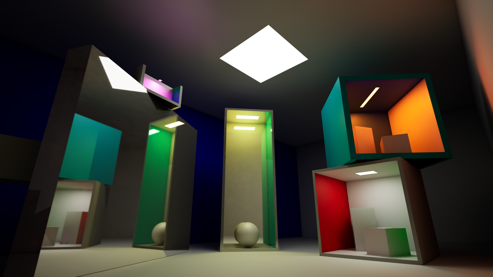

# ue5-parametric-cornell-box
A Parametric Cornell Box Actor for Unreal Engine 5

## Purpose
This project provides a blueprint allowing to create fully parametric Cornell Boxes in the Unreal Editor.

A [Cornell Box](https://en.wikipedia.org/wiki/Cornell_box) is a common test case used by graphics professionals and researchers to measure the quality of a global illumination and light transport method, such as - in the case of Unreal Engine 5 - _Lumen_, _Path Tracing_, and _Static Lighting_.

The purpose of this product is to be used as a tool in the Editor to analyze and understand Lumen behavior (direct lighting, specular lighting, global illumination, reflections/mirrors) in a tightly controlled environment: a Cornell Box.

## Usage
The functionality is exposed in the Editor as a Blueprint Actor: to instantiate a new Cornell Box, simply drag and drop the __BP_ParametricCornellBox__ blueprint in the scene. The newly instanced Box is then configurable through dedicated attributes in the Details panel of the actor: dimensions, lighting setup, walls material and colors, and box contents.

Boxes are fully reconstructed each time one of their attributes is updated, allowing for interactive modification within the Editor. This is done automatically by the blueprint construction script. The default Box attributes are set to one of a standard Cornell Box, scaled out 5 times, for practical purposes.

Take a look at the [Attributes section](attributes) for a comprehensive list of features and available attributes. 

An example map is provided in the plugin, in the Maps folder: _Demo.umap_. This map showcases various features through different Cornell Boxes instanced in the scene.

This blueprint is intended to be mostly used with real-time Lumen and Raytracing enabled (including raytraced shadows), as well as with Path Tracing. It is nevertheless possible to use it in Static Lighting scenarios, by changing the mobility attribute in the "Advanced" section of "Lighting" attributes.

## Attributes

The following screenshot gives an overview of them:

## Screenshots

